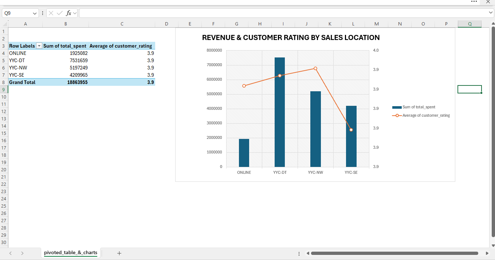
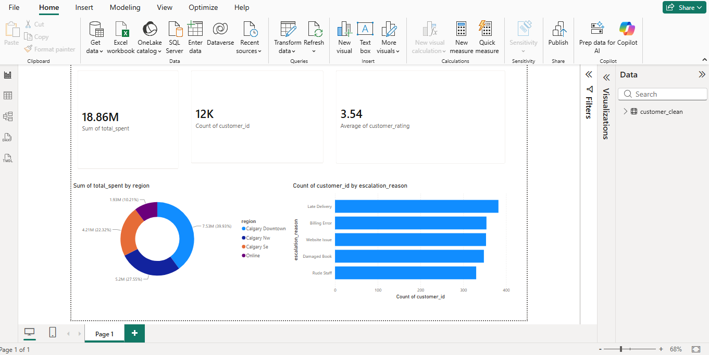

# Customer Operations & Financial Risk Analysis

## Project Overview
This repository contains an end-to-end data analysis pipeline designed to identify operational inefficiencies in customer support and quantify their direct impact on company revenue. By combining SQL data aggregation, Python/R processing, and interactive dashboards (Excel & Power BI), this project isolates high-risk customer support escalations to drive retention strategies.

## Key Insights & Business Value
Using SQL to aggregate escalated support cases, the data reveals critical vulnerabilities in customer satisfaction and financial retention:
* **Quantifiable Revenue Risk:** Identified specific customer escalation categories threatening between **\$429,000 and \$520,000** each in vulnerable contract revenue.
* **Volume Analysis:** Isolated high-frequency friction points causing between **293 and 337 escalated complaints** per incident type.
* **Customer Sentiment Impact:** Proved a direct correlation between unresolved operational issues and depressed customer health scores, with average ratings dropping heavily to a stagnant **3.48 to 3.51 out of 5**.

---

## Repository Structure

```text
├── data/
│   ├── customer_raw.csv              # Initial raw customer profiles
│   ├── customer_clean.csv            # Cleaned data output from scripts
│   └── customer_reporting_data.csv   # Segmented dataset exported from Excel
├── notebooks_and_scripts/
│   ├── myscript.py                   # Python pipeline for data formatting
│   └── myscript.R                    # R script executing advanced statistical operations
├── sql_queries/
│   ├── database_customer_queries.sql # Primary analysis & aggregation script
│   ├── customers_202606261854.md     # Exported DBeaver query result table
│   ├── customers_202606261855.md     # Exported DBeaver query result table
│   └── SELECT_COUNT_customer...md    # Exported DBeaver summary table
├── visualizations/
│   ├── customer_dashboards.xlsx      # Excel workbook featuring dynamic Pivot Tables & Charts
│   └── Customer_Operations_Analysis.pbix # Interactive Power BI operational dashboard
├── .gitignore                        # Prevents tracking temporary local database files
└── README.md                         # Project documentation and summary
```

## Tech Stack & Skills Demonstrated
* **Advanced SQL (DBeaver):** 
  * **Window Functions:** Implemented analytical ranking operations using `DENSE_RANK() OVER (PARTITION BY ... ORDER BY ...)` to evaluate regional spending hierarchies.
  * **Conditional Logic:** Built dynamic customer tier segmentations (`VIP tier`, `Gold tier`, `Standard tier`) utilizing programmatic `CASE WHEN` statements.
  * **Data Aggregation & Metrics:** Computed macro-level KPIs using mathematical and rounding functions (`COUNT`, `SUM`, `AVG`, `ROUND`) to establish revenue baseline risk.
  * **Data Engineering Cleanliness:** Enforced explicit database styling rules, uppercase formatting for keywords, and strict conditional filtering logic.

* **Excel:** Dashboard engineering using Pivot Tables and Pivot Charts for rapid executive reporting.
* **Power BI:** Building deep-dive relational data models and interactive operational dashboards.
* **Python & R:** Reproducible data scripting and statistical plotting.

## Visualizations & Dashboards

This project delivers insights across three major reporting tools:

* **Excel Dashboard (`visualization/customer_dashboard.xlsx`):** Utilizes Pivot Tables and Pivot Charts for dynamic customer segmentation summaries.
  
  

* **Power BI Report (`visualization/Customer_Operations_Analysis.pbix`):** Interactive dashboard focused on deeper operational KPIs.
  
  

* **R ggplot2 (`visualization/r_escalation_chart.png`):** Custom static chart tracking support ticket escalation patterns.
